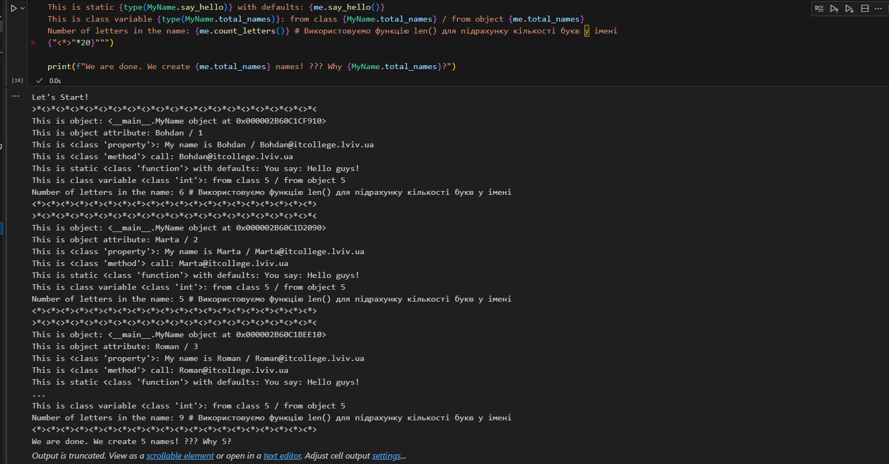

# Звіт до роботи №3
## Тема: _Знайомство з ООП_;
### Мета роботи: _навчитись працювати та створювати класи в Python_;
---
### Виконання роботи
- Результати виконання завдання 1...N;
1. Створили файли [файли Python Notebook](note.ipynb) де працювали з класами;
2. Розробили клас WhoHasPets який симулював клуб любителів домашніх тварин;
3. Всі програми створювались та виконувались у [Python Notebook](note.ipynb)
4. Винесли створений клас у модуть та попрактикувались в його імпорті;
5. Скріншот роботи програми


6. Відповіді на запитання:

Чому коли передаємо значення None створюється обєкт з іменем Anonymous?

Для створення об'єкта MyName у тому випадку, якщо name дорівнює None.

Як змінити текст привітання при виклику методу say_hello()? Допишіть цю частину коду.

Щоб це зробити, потрібно дописати в рядку say_hello в лапках відповідний текст привітання. Ось приклад того, як це зробив я:
```
@staticmethod
    def say_hello(message="Hello guys!"): # У даному випадку написав Hello guys!
        """Static method
        """
        return f"You say: {message}"
```
Допишіть функцію в класі яка порахує кількість букв і імені (підказка: використайте функцію len());
````
"""Метод для підрахунку кількості букв у імені
 """
return len(self.name) if self.name is not None else 0
```````
Порахуйте кількість імен у списку names та порівняйте із виведеним результатом. Дайте відповідь чому маємо різну кількість імен?

Тому що коли ми створюємо анонімний об'єкт MyName за допомогою методу anonymous_user(), total_names збільшується на 1, навіть якщо ми явно не передамо ім'я.

Висновок:

у висновку потрібно відповісти на запитання:
```
❓ Що зроблено в роботі;
- Під час виконання роботи були вивчено основи ООП. Зокрема різні методи та класи.
❓ Чи досягнуто мети роботи;
- Мети роботи досягнуто
❓ Які нові знання отримано;
- Отримано знання з основ ООП
❓ Чи вдалось відповісти на всі питання задані в ході роботи;
- Так
❓ Чи вдалося виконати всі завдання;
- Так, вдалося виконати усі завдання
❓ Чи виникли складності у виконанні завдання;
- Виникали, але їх вдалось вирішити(ще не знаю)
❓ Чи подобається такий формат здачі роботи (Feedback);
- Так, такий формат здачі робіт подобається
❓ Побажання для покращення (Suggestions);
- На даний момент нічого
```