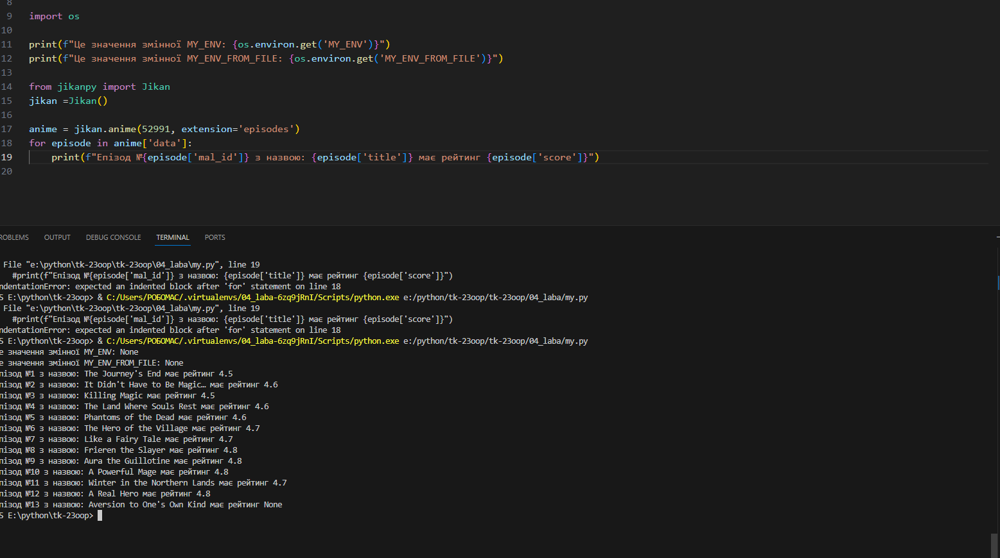

# Звіт до роботи №4
## Тема: _Робота з віртуальними середовищами_;
### Мета роботи: _Навчитись створювати та працювати у віртуальних середовищах в Python_;
---
### Виконання роботи
- Результати виконання завдання:
1. Створили віртуальне середовище за допомогою venv та pipenv. Створени [Pipfile](./Pipfile) та [Pipfile.lock](./Pipfile.lock);
2. Створено програму яка буде працювати у віртуальних середовищах. Код для програми представлно у файлі [my.py](./my.py);
3. Навчились створювати та працювати у віртуальних середовищах
4. Проробили команди для створення віртуального середовища (VENV) та його активації ;
5. Остання команда дала такий результат


Ця команда вказує нам інформацію про біблотеку. Зокрема , її версію, автора, домашню сторінку, ліцензію, залежності та інші деталі, які її стосуються.

6. Попрацювали з Pipenv. Написаний код видав наступний результат


7. Попрацювали зі змінними середовищами. Написаний код видав наступний результат:


Якщо зробити скрипт без віртуальної активації середовища, то він не виконається.


Висновок:

у висновку потрібно відповісти на запитання:
```
❓ Що зроблено в роботі;
- Під час виконання роботи була пророблена низка команд для роботи зі сторонніми бібліотеками. Також виконана робота з з Pipenv та змінними середовищами.
❓ Чи досягнуто мети роботи;
- Мети роботи досягнуто
❓ Які нові знання отримано;
- Отримано знання про сторонні бібліотеки, віртуальні та змінні середовища.
❓ Чи вдалось відповісти на всі питання задані в ході роботи;
- Так
❓ Чи вдалося виконати всі завдання;
- Так, вдалося виконати усі завдання
❓ Чи виникли складності у виконанні завдання;
- Виникали, але їх вдалось вирішити(ще не знаю)
❓ Чи подобається такий формат здачі роботи (Feedback);
- Так, такий формат здачі робіт подобається
❓ Побажання для покращення (Suggestions);
- На даний момент нічого
```


    