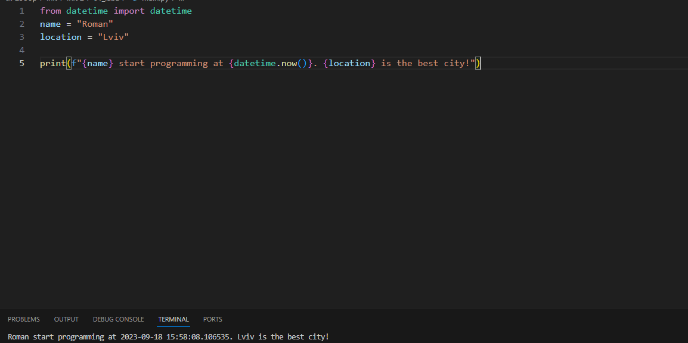

# Звіт до роботи
## Тема: _Оформлення та здача робіт_
### Мета роботи: _навчитись роботі з форматуванням Markdown та створювати звіти з використанням файлів README_
---
### Виконання роботи
- Результати виконання завдання *1...N*;
    1. Виконали першу програму. Результат виконання: ;
    1. Модифікували програмута використали [Python Notebook для її виконання](nb.ipynb);
    1. Після виконання всхі клітинок Python ноутбуку програма   вивела: ;
    1. Зробили запит до ChatGPT щоб написав то пояснив першу програму.
    Модифікували його відповідь на її основі зробили [новий Python Notebook](ai.ipynb)
    1. Програма вивела значення 
    1. Отримано наступні результати 
    1. Навчились писати прості програми на мові Python
- вставлені рисунки (скріншоти екрана або фотографії виконаного завдання у зошиті);

> якщо графічних файлів багато то краще помістити їх у окрему папку, наприклад у мене це папка `pictures`. Уважно дивіться коли вставляєте URL - файл має бути представленим як `raw`. 


- вставлений код / текстовий або числовий результат / інші результати:
```python
def simple_function_example():
    pass
```
```text
<< SOME text HERE >>
```

- результати виконання індивідуального завдання (якщо такі є);

### Висновок: 
> у висновку потрібно відповісти на запитання:
- :question: Що зроблено в роботі;
Проста програма на Python
- :question: Чи досягнуто мети роботи;
Мету досягнуто
- :question: Які нові знання отримано;
Отримав елементарні знання щодо синтаксису Python
- :question: Чи вдалось відповісти на всі питання задані в ході роботи;
На всі запитання відповісти вдалось
- :question: Чи вдалося виконати всі завдання;
Всі завдання виконати вдалось
- :question: Чи виникли складності у виконанні завдання;
Складності не виникали 
- :question: Чи подобається такий формат здачі роботи (Feedback);
Так
- :question: Побажання для покращення (Suggestions);
На даний момент не маю
---